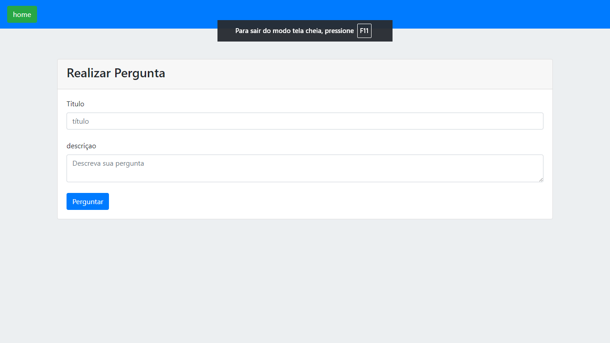
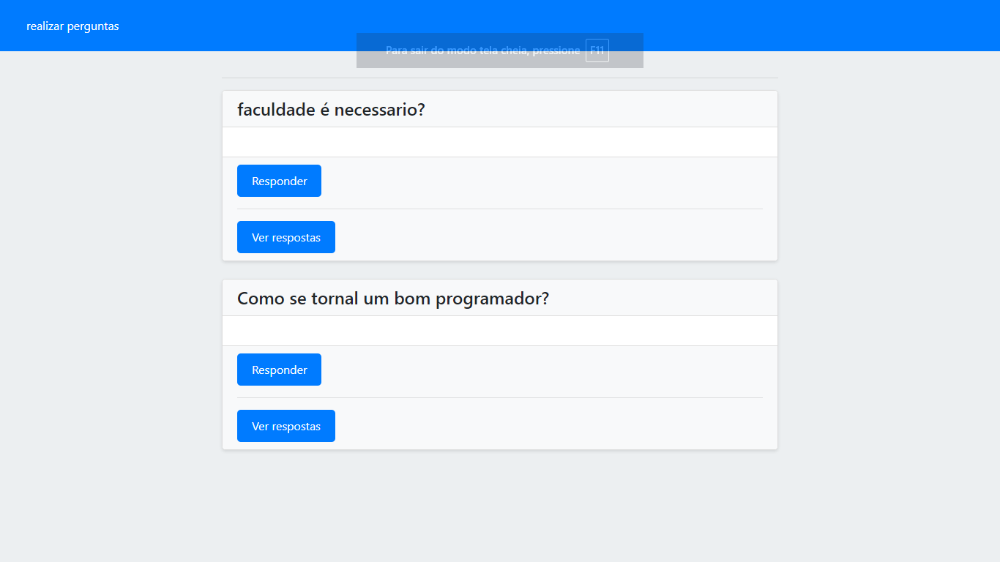
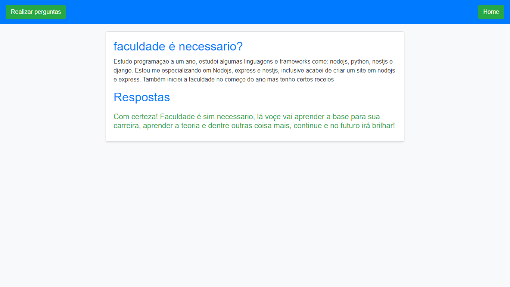

# Plataforma de Perguntas e Respostas

> Um projeto de plataforma de perguntas e respostas utilizando Express.js, EJS e MySQL.

## Índice

- [Visão Geral](#visão-geral-do-projeto)
- [Estado Atual](#estado-atual)
- [Tecnologias Utilizadas](#tecnologias-utilizadas)
- [Capturas de Tela](#capturas-de-tela)
- [Contribuição](#contribuição)
- [Licença](#licença)
- [Contato](#contato)

## Visão Geral do Projeto

Este projeto tem como objetivo criar uma plataforma de perguntas e respostas utilizando Express.js, o motor de templates EJS, e banco de dados MySQL. A plataforma permite aos usuários fazer perguntas, fornecer respostas e interagir com o conteúdo de outros usuários.

## Estado Atual

O projeto está atualmente completo e é baseado em um curso utilizado para fins de estudo.

## Tecnologias Utilizadas

- **Express.js**: Framework backend para lidar com lógica do servidor e roteamento.
- **EJS**: Motor de templates para renderização de templates HTML no servidor.
- **MySQL**: Sistema de gerenciamento de banco de dados relacional usado para armazenar e recuperar dados.

## Capturas de Tela

### Tela de Realizar Pergunta

### Tela de Perguntas

### Tela de Respostas

## Contribuição

Contribuições são sempre bem-vindas! Sinta-se à vontade para fazer um fork do repositório e enviar um pull request.

1. Faça um fork do projeto.
2. Crie uma branch para sua feature (`git checkout -b minha-feature`).
3. Commit suas mudanças (`git commit -m 'Adiciona minha feature'`).
4. Envie para a branch (`git push origin minha-feature`).
5. Abra um pull request.

## Licença

Este projeto está licenciado sob a MIT License. Veja o arquivo [LICENSE](LICENSE) para mais detalhes.

## Contato

Feito com ❤️ por [Artur Santos](https://www.linkedin.com/in/artur-santos-6035862a0)
